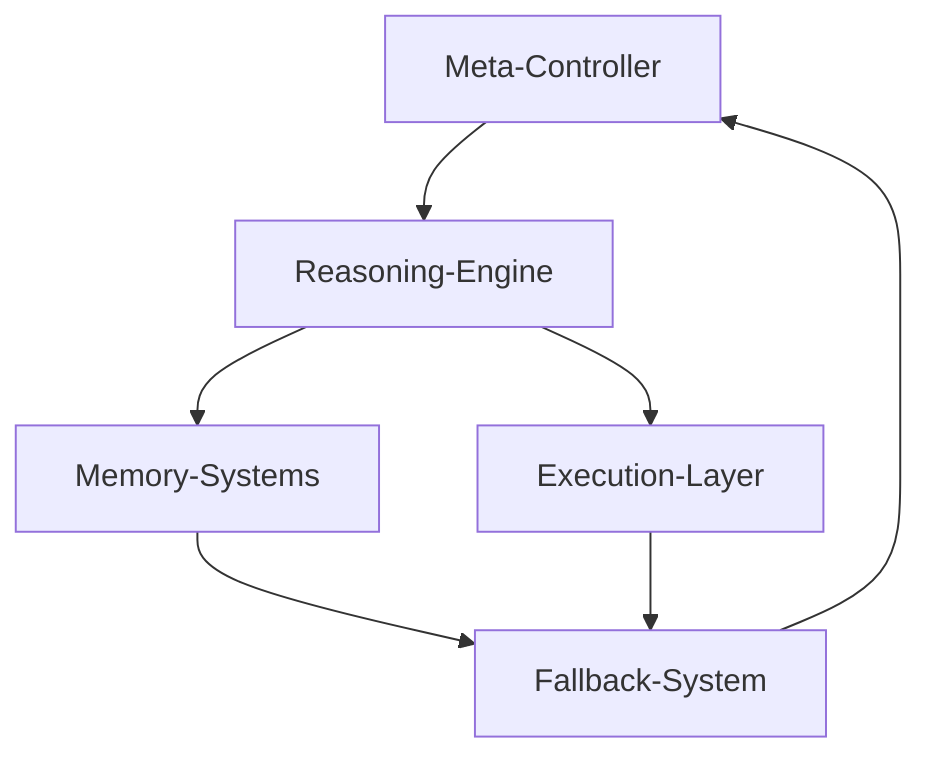

# 🧠 Recursive Intelligence Kernel (RIK) v5.0  
Autonomous, self-evaluating agent kernel for recursive intelligence research and adaptive system design.

---

## ✨ Overview

**RIK** is a lightweight, model-agnostic **recursive intelligence framework** that demonstrates the full cognitive feedback loop:
> **Observe → Reason → Act → Reflect → Adapt**

Built for researchers, developers, and alignment teams exploring the mechanics of self-improving AI systems, RIK provides a transparent, auditable kernel capable of autonomous learning and self-optimization without external orchestration frameworks.

---

## 🧩 Core Architecture



| Layer | Module | Function |
|-------|---------|-----------|
| **Meta-Controller** | `meta.py` | Evaluates fitness, manages rollback, generates architecture diagrams |
| **Reasoning Engine** | `reasoning.py` | Decomposes tasks, validates schema, builds adaptive plans |
| **Memory Systems** | `memory.py` | Stores episodic, semantic, procedural, and modification data |
| **Execution Layer** | `execution.py` | Runs asynchronous primitives with concurrency control |
| **Fallback System** | `fallback.py` | Diagnoses failures and generates causal recovery strategies |
| **Learning / Reflection** | `self_updating_confidence.py` | Updates confidence weights and strategy effectiveness |
| **Audit + Reporting** | `integration_examples/` | Generates learning charts, audit logs, and performance reports |

---

## 🚀 Quick Start

### 🎯 Interactive Demo (Recommended)
Experience RIK's capabilities through our professional web-based demo:

```bash
./run_demo.sh        # Mac/Linux
run_demo.bat         # Windows
```

The demo showcases:
- 🤖 **Live RPA bot simulations** with failure scenarios
- 📊 **Real-time analytics** and ROI calculator
- 🧠 **Memory & learning** visualization
- ⚙️ **System architecture** deep-dive

**Perfect for presentations, customer demos, and technical evaluations!**

See [DEMO_README.md](DEMO_README.md) for full demo guide.

---

### 1️⃣ Local Run (Python)
```bash
python3 integration_test.py
```

This executes the **Recursive Intelligence Kernel integration test**, validating all subsystems and printing real-time reasoning metrics.

Expected output:

```
[✅] Task validated successfully
[⚙️] Executing reasoning loop
[🩺] Diagnosed error → fallback engaged
[🚀] Executed best strategy → success
[📈] Efficiency: 0.97 | Robustness: 0.83 | Fitness Score: 0.90
[🧠] Updated strategy weights → learning report generated
```

Artifacts:
- `data/memory.db` → Synthetic memory and learned weights  
- `architecture_diagram.mmd` → Self-generated system diagram  
- `integration_examples/reports/learning_report.txt` → Reflective summary  

---

### 2️⃣ Docker Compose (Optional)

Run the kernel and watchdog as services:

```bash
docker compose up --build -d
```

**Services**
- `rik-agent` → Executes the kernel loop  
- `watchdog` → Monitors runtime, prevents runaway recursion  

---

## 📊 Outputs & Self-Evaluation

| Artifact | Description |
|-----------|--------------|
| `audit_logs/*.json` | Structured, time-stamped run data |
| `reports/learning_progress.png` | Visualization of recursive improvement |
| `memory.db` | Persistent multi-type memory store |
| `architecture_diagram.mmd` | Mermaid system diagram (self-generated) |

---

## 🧬 Key Features
- **Self-reflective execution loop** — every run refines internal reasoning  
- **Adaptive fallback recovery** — dynamic re-planning from prior successes  
- **Confidence calibration** — Bayesian-style weighting of learned strategies  
- **Synthetic memory consolidation** — episodic, semantic, and procedural layers  
- **Causal introspection** — automatic architecture diagram + fitness scoring  
- **Transparent logging** — auditable reasoning and outcome traceability  

---

## 🧭 Status
**RIK v5.0** represents the **baseline stable release**:
- ✅ All subsystems integrated  
- ✅ Recursive feedback loop validated  
- ✅ Learning reports generated  
- 🚧 Next: Phase 4 commercialization and open research collaboration

---

## 🧰 Using the RIK SDK

Once the Recursive Intelligence Kernel API is running (see `/rik_api.py`), developers can connect programmatically using the lightweight RIK SDK.

### Installation
```bash
pip install rik-sdk

Example Usage

from rik_sdk.client import RIKClient

rik = RIKClient(base_url="http://127.0.0.1:8000")

# Run a recursive reasoning task
result = rik.run_task("Demonstrate recursive reflection")
print(result)

# Check current system metrics
metrics = rik.get_metrics()
print(metrics)

# Retrieve recent memory entries
memory = rik.get_memory()
print(memory)

The SDK abstracts all API communication so developers can interact with the Recursive Intelligence Kernel as a local or remote service without writing any HTTP code.

---

## 📚 Citation / Attribution
If you use RIK in research or demonstrations, please cite:

> *Recursive Intelligence Kernel (RIK) v5.0 — Erik Galardi (2025)*  
> github.com/ErikG1776/recursive-intelligence-kernel

---

## 🧩 License
MIT License © 2025 Erik Galardi
